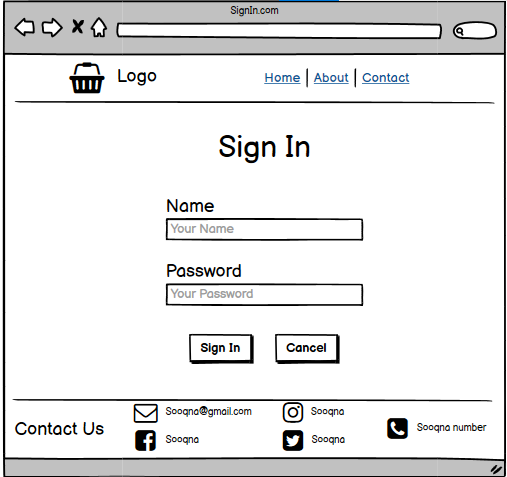
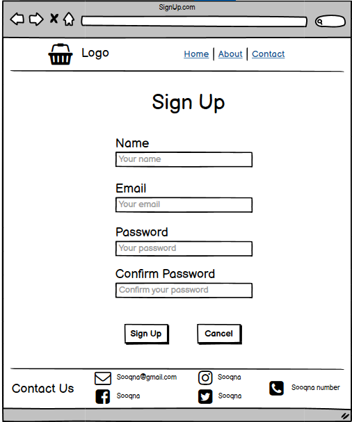
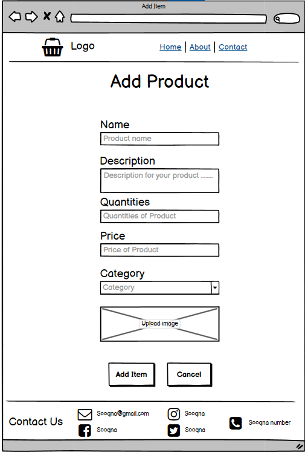
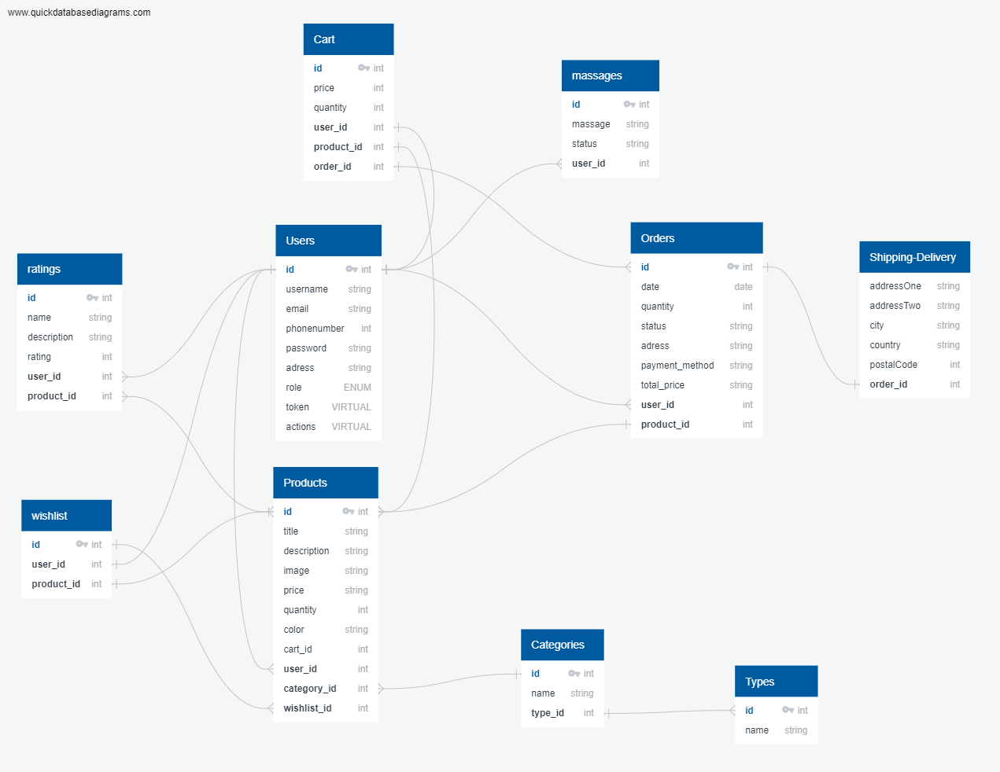

[](./assests/sooqnafavicon.jpg)


## Project Idea

**Sooqna** is an online platform that facilitates consumer-to-consumer sales through its website

### What problem or pain point does it solve?

- Reducing the amount of time, effort, and money spent on product search.

- It provides a simple channel for connecting seller and buyer.

- Offer a safe delivery.

## [Demo](https://sooqna.herokuapp.com/)


## Wireframes:

|                                           Pages                                            |                                    Pages                                    |
| :----------------------------------------------------------------------------------------: | :-------------------------------------------------------------------------: |
|            |           |
|  |   |


# API Documentation 

# User And Admin Stories :

## Admin Dashboard

- As an admin, I would like to know the information for all users in Sooqna website.

- As an admin , I would like to delete any user that sale an illegal product.

- As an admin , I would like to see a detail for each product so that I can eventually delete it.

- As an admin ,I would like to have a dashboard where I can see a list of product categories.

- As an admin, I would like add and save a new category so that I can expand my product lines.

- As an admin , I would like to see a list types of the products assigned to a category.

- As an admin, I would like add and save a new type for a new category so that I can expand my product lines.

- As an admin, I would like to see all confirmed orders by users to approve it and sent to user using delivery shipping.


## User Site

- As a user, I would like to register for an account on the Sooqna wibsite, so that I can make purchases.

- As a user, I would like to securely login to my account so that I can add my products.

- As a user, I would like to see products available for sale so that I can browse through the inventory for purchase.

- As a user, I would like to add a new items to sell it.

- As a user, I would like to update and delete any product that I added to sell.

- As a user, I would like the ability to view my desired purchases while browsing the other products on the site.

- As a user, I would like to search for all products related to specific user.

- As a user, I would like to search for all products related to specific category.

- As a user, I would like to search about all products for specific name or color so that I can choose which product that I want to buy it.

- As a user, I would like to search about all products that have specific price so that I can buy.

- As a user, I would like to see all products in my cart or wishlist.

- As a user, I would like to delete any products in my cart or wishlist.

- As a user, I would like to delete all products in my cart or wishlist.

- As a user, I would like to add products to my cart / wish list.

- As a user, I would like to add products from my wish list to cart.

- As a user, I would like to submit / confirm /receive my order/s.

- As a user, I would like to view my profile.

- As a user, I would like to update my profile.

- As a user, I would like to delete my profile.

- As a user, I would like to rate any product.

- As a user, I would like to see all ratings for a specific product.

- As a user, I would like to join a room with anther user.

- As a user, I would like to send a message to another user him.

- As a user, I would like to see all messages between me and the other user.

## Dependencies Used

    "base-64": "^1.0.0",
    "bcrypt": "^5.0.1",
    "cors": "^2.8.5",
    "dotenv": "^16.0.1",
    "express": "^4.18.1",
    "jest": "^28.1.3",
    "jsonwebtoken": "^8.5.1",
    "morgan": "^1.10.0",
    "pg": "^8.7.3",
    "sequelize": "^6.21.3",
    "sequelize-cli": "^6.4.1",
    "socket.io": "^4.5.1",
    "socket.io-client": "^4.5.1",
    "sqlite3": "^5.0.10",
    "supertest": "^6.2.4

## Installation

**Sooqna** requires Node.js v16+ to run.

Install the dependencies and devDependencies and start the server.

```
cd sooqna
npm i
npm start
```

## AUTH ROUTES
<br>

| **Path** | **Method** | **Response and Usage**              | **Who is can access this page** |
|----------|------------|-------------------------------------|---------------------------------|
| /signup  | post       | to create a user                    | any user                        |
| /signin  | post       | to login a user and receive a token | any user saved in the data base |

<br>

## Admin ROUTES

<br>

| **Path**                 | **Method** | **Response and Usage**        | **Who is can access this page** |
|--------------------------|------------|-------------------------------|---------------------------------|
| /admin/users             | get        | Get All Users                 | admin                           |
| /admin/product           | get        | Get All Products              | admin                           |
| /admin/confirmedorder    | get        | Get All Confirmed Orders      | admin                           |
| /admin/catagory          | get        |  Get All Categories           | admin                           |
| /admin/type              | get        |  Get All Types                | admin                           |
| /admin/typesof           | get        | Get All Types Inside Category | admin                           |
| /admin/catagory          | post       |  Create A New Catagory        | admin                           |
| /admin/type              | post       |  Create A New Type            | admin                           |
| /admin/confirmorders     | put        |  Approve Order/s              | admin                           |
| /admin/deleteuser/:id    | delete     | Delete A User                 | admin                           |
| /admin/deleteproduct/:id | delete     | Delete A Product              | admin                           |


<br>

## User Setting ROUTES

<br>

| **Path**       | **Method** | **Response and Usage** | **Who is can access this page**  |
|----------------|------------|------------------------|----------------------------------|
| /userinfo      | get        | View user profile      | Only the user has this account   |
| /updateprofile | put        | Update user account    | Only the user has this account   |
| /deleteprofile | delete     | Delete user account    | Only the user has this account   |


<br>


## Product ROUTES

<br>

| **Path**     | **Method** | **Response and Usage** | **who is can access this page**    |
|--------------|------------|------------------------|------------------------------------|
| /product     | get        | Get All Products       | User Who (Own/Sell) these Products |
| /product/:id | get        | Get One Product        | User Who (Own/Sell) these Products |
| /product     | post       | Create A Product       | User Who (Own/Sell) these Products |
| /product/:id | put        | Update A Product       | User Who (Own/Sell) these Products |
| /product/:id | delete     | Delete One Product     | User Who (Own/Sell) these Products |
| /product     | delete     | Delete All Products    | User Who (Own/Sell) these Products |


<br>

## Order ROUTES

<br>

| **Path**   | **Method** | **Response and Usage** | **Who is can access this page** |
|------------|------------|------------------------|---------------------------------|
| /order     | get        | Get All Orders         | User Who submit the order/s     |
| /order     | post       | Create An Order        | User Who submit the order/s     |
| /order/:id | put        | Update An Order        | User Who submit the order/s     |
| /order/:id | delete     | Delete One Order       | User Who submit the order/s     |
| /order     | delete     | Delete All Orders      | User Who submit the order/s     |

<br>

## Wishlist ROUTES

<br>

| **Path**      | **Method** | **Response and Usage** | **Who is can access this page** |
|---------------|------------|------------------------|---------------------------------|
| /wishlist     | get        | Get All Wishlists      | User Who is signed in           |
| /wishlist     | post       | Create An Wishlist     | User Who is signed in           |
| /wishlist/:id | delete     | Delete One Wishlist    | User Who is signed in           |
| /wishlist     | delete     | Delete All Wishlists   | User Who is signed in           |


<br>


## Cart ROUTES

<br>

| **Path**  | **Method** | **Response and Usage** | **Who is can access this page** |
|-----------|------------|------------------------|---------------------------------|
| /cart     | get        | Get All Cart           | User Who is signed in           |
| /cart     | post       | Create A Cart          | User Who is signed in           |
| /cart/:id | delete     | Delete One Cart        | User Who is signed in           |
| /cart     | delete     | Delete All in Cart     | User Who is signed in           |


<br>

## Search ROUTES

<br>

| **Path**        | **Method** | **Response and Usage** | **Who is can access this page** |
|-----------------|------------|------------------------|---------------------------------|
| /searchid       | get        | Search By User Id      | User Who is signed in           |
| /searchname     | get        | Search By Name         | User Who is signed in           |
| /searchcolor    | get        | Search By Color        | User Who is signed in           |
| /searchcategory | get        | Search By Category     | User Who is signed in           |
| /searchprice    | get        | Search By Price        | User Who is signed in           |


<br>

## Shopping ROUTES

<br>

| **Path**                       | **Method** | **Response and Usage**            | **Who is can access this page** |
|--------------------------------|------------|-----------------------------------|---------------------------------|
| /addtocart/:id                 | post       | Add Product To Cart               | User Who is signed in           |
| /addtowishlist/:id             | post       | Add Product To WishList           | User Who is signed in           |
| /productfromwishlisttocart/:id | post       | Add Product From WishList To Cart | User Who is signed in           |
| /submitorder                   | post       | Submit An Order                   | User Who is signed in           |
| /confirmorder                  | put        | Confirm An Order                  | User Who is signed in           |
| /reciveorder                   | put        | Recive An Order                   | User Who is signed in           |


<br>

## Rating ROUTES

<br>

| **Path**    | **Method** | **Response and Usage**            | **Who is can access this page** |
|-------------|------------|-----------------------------------|---------------------------------|
| /rating/:id | get        | Get All Rating Related to Product | User Who is signed in           |
| /rating/:id | post       | Add Rating                        | User Who is signed in           |


<br>

## Messages / Chat ROUTES

<br>

| **Path**         | **Method** | **Response and Usage**         | **Who is can access this page** |
|------------------|------------|--------------------------------|---------------------------------|
| /joinroom/:id    | post       | Join A Room                    | User Who is signed in           |
| /sendmessage/:id | post       | Send Message                   | User Who is signed in           |
| /allmessages/:id | get        | Get Messages Between Two Users | User Who is signed in           |
| /allmessages     | get        | Get All Messages               | User Who is signed in           |

<br>

## Shipping ROUTES

<br>

| **Path**      | **Method** | **Response and Usage**           | **Who is can access this page** |
|---------------|------------|----------------------------------|---------------------------------|
| /shipping/:id | post       | Create Shipping Delivery Details | User Who is signed in           |


<br>


## Project Tree

```
├── package-lock.json
├── package.json
└── src
    ├── error-handlers
    │   ├── 404.js
    │   └── 500.js
    ├── middlewares
    │   ├── acl.js
    │   ├── basic.js
    │   ├── bearer.js
    │   └── logger.js
    ├── models
    │   ├── cart-model.js
    │   ├── category-model.js
    │   ├── data-collection.js
    │   ├── index-model.js
    │   ├── massage-model.js
    │   ├── order-model.js
    │   ├── product-model.js
    │   ├── rating-model.js
    │   ├── shipping-delivery-model.js
    │   ├── type-model.js
    │   ├── user-model.js
    │   └── wishlist-model.js
    ├── router
    │   ├── adminRoutes.js
    │   ├── auth-routes.js
    │   ├── cart-routes.js
    │   ├── meseging.js
    │   ├── order-routes.js
    │   ├── products-routes.js
    │   ├── rating-route.js
    │   ├── routes.js
    │   ├── search-routes.js
    │   ├── shippingRoutes.js
    │   ├── shop-route-functios.js
    │   ├── userAccountSetting.js
    │   └── wishList-routes.js
    └── server.js
```
## License

MIT

## Domain Modeling


## Database Schema Diagram




# Resources :

- ### [Npm Documentation](https://www.npmjs.com/)

- ### [Sequelize Documentation](https://socket.io/docs/v4//)

- ### [Socket.IO Documentation](https://sequelize.org/docs/v6/)

- ### [Realtime Chat App In ReactJS and NodeJS | Socket.io Tutorial](https://www.youtube.com/watch?v=NU-HfZY3ATQ)


